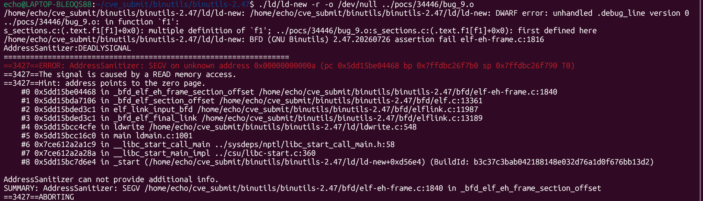

# 漏洞：GNU Binutils ld 在可重定位链接畸形 .eh_frame 时 `_bfd_elf_eh_frame_section_offset` 存在空指针解引用（NULL Dereference）

**项目：** GNU Binutils / GNU ld (https://sourceware.org/git/?p=binutils-gdb.git)
**版本：** 漏洞存在于 binutils 2.47（发布包版本日期 `20260726`）及开发快照 `2.47.50.20260722`（提交 `640a79623`），截至本文撰写（2026-08-16）尚无上游修复
**日期：** 2026-07-28
**严重性：** 中危（MEDIUM）
**OWASP：** 不适用 - 原生二进制解析内存安全
**CWE：** CWE-476 - 空指针解引用

------

## 受影响文件

```text
bfd/elf-eh-frame.c（`_bfd_elf_eh_frame_section_offset`）
bfd/elf.c（`_bfd_elf_section_offset` 调用路径）
bfd/elflink.c（`elf_link_input_bfd`、`_bfd_elf_final_link`）
ld/ldwrite.c（`ldwrite`，通过 ld -r 的触发路径）
```

## 根本原因

在可重定位链接（`ld -r`）期间，最终链接阶段经由 `elf_link_input_bfd()` → `_bfd_elf_section_offset()` → `_bfd_elf_eh_frame_section_offset()` 查询与 `.eh_frame` 相关重定位的节偏移。畸形的 `.eh_frame` 节使 CIE/FDE 解析状态与后续查询不一致，`cie_inf`（或等价状态）在保持为 NULL 的情况下即被解引用。`_bfd_elf_eh_frame_section_offset()` 在 `bfd/elf-eh-frame.c:1840` 处读取 NULL 附近的地址（`0xa`），使 `ld` 进程崩溃，属于 DoS 级空指针解引用。

该缺陷位于 eh_frame 处理器的节偏移查询路径，与 bug 34445（写入路径崩溃）不同；报告者判断其可能是对 bug 33478 和 bug 33499 的不完整修复。截至本文撰写，上游尚未提供修复提交。

## 复现步骤

以下命令假定本报告的 `pocs` 目录与构建的 `binutils-gdb` 目录相邻：

```bash
git clone https://sourceware.org/git/binutils-gdb.git binutils-gdb
cd binutils-gdb
git checkout 640a79623
CC=gcc CFLAGS='-g -O1 -fsanitize=address -fno-omit-frame-pointer -fno-common' \
LDFLAGS='-fsanitize=address' \
./configure --disable-gdb --disable-gdbserver --disable-sim --disable-cet \
            --disable-werror --disable-nls --enable-targets=x86_64-linux-gnu MAKEINFO=true
make -j
```

binutils 2.47 发布包（版本日期 `20260726`）同样复现。运行 PoC：

```bash
export ASAN_OPTIONS="abort_on_error=0:symbolize=1:detect_leaks=0:allocator_may_return_null=1:halt_on_error=1"
./ld/ld-new -r -o /dev/null ../pocs/34446/bug_9.o
```

在漏洞版本上的预期结果：

```text
==65106==ERROR: AddressSanitizer: SEGV on unknown address 0x00000000000a
The signal is caused by a READ memory access.
#0 _bfd_elf_eh_frame_section_offset   bfd/elf-eh-frame.c:1840
#1 _bfd_elf_section_offset            bfd/elf.c:13361
#2 elf_link_input_bfd                 bfd/elflink.c:11987
#3 _bfd_elf_final_link                bfd/elflink.c:13189
#4 ldwrite                            ld/ldwrite.c:548
SUMMARY: AddressSanitizer: SEGV in _bfd_elf_eh_frame_section_offset
```



## 影响

精心构造的目标文件可在可重定位链接期间使 `ld` 崩溃，造成拒绝服务。任何将 GNU ld 暴露于不可信输入文件的工具链、构建系统或 CI 流水线（例如对用户上传目标文件执行部分链接的服务），都可能被该畸形 `.eh_frame` 输入终止。

## 建议修复

在 `_bfd_elf_eh_frame_section_offset()` 及相关 eh_frame 查询路径中，对解析得到的 CIE/FDE 状态进行充分校验：状态为 NULL 或与输入不一致时应返回链接错误而非继续解引用；并将该畸形 `.eh_frame` 样本纳入 AddressSanitizer 回归覆盖。截至本文撰写上游尚无修复，建议在修复发布前避免对不可信目标文件直接执行 `ld -r`，或在上游修复后及时升级。

------

## 参考

- Bugzilla issue 34446：https://sourceware.org/bugzilla/show_bug.cgi?id=34446
- PoC 附件（bug_9）：https://sourceware.org/bugzilla/attachment.cgi?id=16874
- 相关的早期 bug 33478：https://sourceware.org/bugzilla/show_bug.cgi?id=33478
- 相关的早期 bug 33499：https://sourceware.org/bugzilla/show_bug.cgi?id=33499
- 相关的写入路径 bug 34445：https://sourceware.org/bugzilla/show_bug.cgi?id=34445
- 漏洞版本：binutils 2.47（版本日期 20260726）/ 开发快照提交 640a79623
- Binutils 仓库：https://sourceware.org/git/?p=binutils-gdb.git
- 复现材料：https://github.com/Ech06/CVE_submit/tree/main/bugzilla/pocs/34446

## 备注

截至 2026-08-16，该 issue 在 Bugzilla 上仍为 UNCONFIRMED，无修复提交。报告者指出该问题可能是对 bug 33478 与 bug 33499 的不完整修复；它与 bug 34445（eh_frame 写入路径崩溃）位于不同的代码路径，本问题属于节偏移查询路径。
