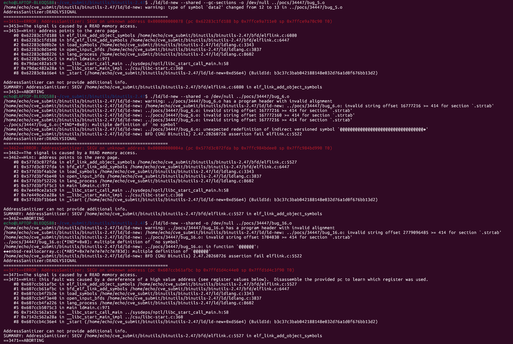

# Vulnerability: NULL Pointer Dereference in `elf_link_add_object_symbols` of GNU Binutils ld When Adding Malformed Symbol/Version Information

**Project:** GNU Binutils / GNU ld (https://sourceware.org/git/?p=binutils-gdb.git)
**Version:** Present in binutils 2.47 (release tarball version date `20260726`) and dev snapshot `2.47.50.20260722` (commit `640a79623`); no upstream fix as of this writing (2026-08-16)
**Date:** 2026-07-28
**Severity:** Medium
**OWASP:** N/A — native binary parsing memory safety
**CWE:** CWE-476 - NULL Pointer Dereference

------

## Affected Files

```text
bfd/elflink.c (`elf_link_add_object_symbols`)
ld/ldlang.c (`load_symbols`, `open_input_bfds` call path)
```

## Root Cause

While `elf_link_add_object_symbols()` adds versioned symbols from a malformed symbol table and/or version information table, unvalidated symbol/alias/section pointers are dereferenced while NULL:

- `bug_5.o` crashes at `bfd/elflink.c:6080` (SEGV reading `0x78`);
- `bug_6.o` and `bug_16.o` first trigger a BFD assertion failure at `bfd/elflink.c:5522`, then crash at `:5527` (SEGV reading `0x4a`). In the 2.47 release tarball both land on the same line (the dev snapshot's `:5528` found in the table corresponds to it — same code).

All three PoCs point to one class of root cause: missing validation of symbol/alias/section pointers during versioned symbol addition. The reporter believes this may be an incomplete fix of bug 33476. As of this writing, no upstream fix commit is available.

## Steps to Reproduce

The following commands assume this report's `pocs` directory sits next to the built `binutils-gdb` directory:

```bash
git clone https://sourceware.org/git/binutils-gdb.git binutils-gdb
cd binutils-gdb
git checkout 640a79623
CC=gcc CFLAGS='-g -O1 -fsanitize=address -fno-omit-frame-pointer -fno-common' \
LDFLAGS='-fsanitize=address' \
./configure --disable-gdb --disable-gdbserver --disable-sim --disable-cet \
            --disable-werror --disable-nls --enable-targets=x86_64-linux-gnu MAKEINFO=true
make -j
```

The binutils 2.47 release tarball (version date `20260726`) also reproduces (all three PoCs). Run the PoCs:

```bash
export ASAN_OPTIONS="abort_on_error=0:symbolize=1:detect_leaks=0:allocator_may_return_null=1:halt_on_error=1"
./ld/ld-new --shared --gc-sections -o /dev/null ../pocs/34447/bug_5.o    # :6080
./ld/ld-new --shared -o /dev/null ../pocs/34447/bug_6.o                  # :5527
./ld/ld-new --shared -o /dev/null ../pocs/34447/bug_16.o                 # :5527
```

Expected result on the vulnerable version:

bug_5 (`:6080`):

```text
==65046==ERROR: AddressSanitizer: SEGV on unknown address 0x000000000078
The signal is caused by a READ memory access.
#0 elf_link_add_object_symbols    bfd/elflink.c:6080
#1 bfd_elf_link_add_symbols       bfd/elflink.c:6447
#2 load_symbols                   ld/ldlang.c:3343
#3 open_input_bfds                ld/ldlang.c:3837
SUMMARY: AddressSanitizer: SEGV in elf_link_add_object_symbols
```

bug_6 / bug_16 (`:5527`):

```text
BFD (GNU Binutils) 2.47.20260726 assertion fail bfd/elflink.c:5522
AddressSanitizer:DEADLYSIGNAL
==65061==ERROR: AddressSanitizer: SEGV on unknown address 0x00000000004a
The signal is caused by a READ memory access.
#0 elf_link_add_object_symbols    bfd/elflink.c:5527
#1 bfd_elf_link_add_symbols       bfd/elflink.c:6447
#2 load_symbols                   ld/ldlang.c:3343
SUMMARY: AddressSanitizer: SEGV in elf_link_add_object_symbols
```



## Impact

A crafted object file can crash `ld` during the input-symbol reading stage, causing denial of service. That stage runs before any real linking work, so build services, compile farms, or CI pipelines that link untrusted object files can all be terminated by a single malformed input.

## Recommended Fix

In the versioned-symbol handling path of `elf_link_add_object_symbols()`, thoroughly validate the symbol, alias, and section pointers: when the input symbol/version tables are inconsistent, report a link error and abort instead of dereferencing NULL; and add these three malformed samples to AddressSanitizer regression coverage. No upstream fix exists as of this writing; until a fix is released, avoid running `ld --shared` directly on untrusted object files, or upgrade promptly after the upstream fix lands.

------

## References

- Bugzilla issue 34447: https://sourceware.org/bugzilla/show_bug.cgi?id=34447
- PoC attachment (bug_5): https://sourceware.org/bugzilla/attachment.cgi?id=16875
- PoC attachment (bug_6): https://sourceware.org/bugzilla/attachment.cgi?id=16876
- PoC attachment (bug_16): https://sourceware.org/bugzilla/attachment.cgi?id=16877
- Related earlier bug 33476: https://sourceware.org/bugzilla/show_bug.cgi?id=33476
- Affected versions: binutils 2.47 (version date 20260726) / dev snapshot commit 640a79623
- Binutils repository: https://sourceware.org/git/?p=binutils-gdb.git
- Reproduction materials (PoC): https://github.com/Ech06/CVE_submit/tree/main/bugzilla/pocs/34447

## Notes

As of 2026-08-16, the issue remains UNCONFIRMED on Bugzilla with no fix commit. The reporter notes it may be an incomplete fix of bug 33476. bug_6 and bug_16 crash on the same line in the 2.47 release tarball (`:5527`), the same code location as the `:5528` recorded for the dev snapshot.
