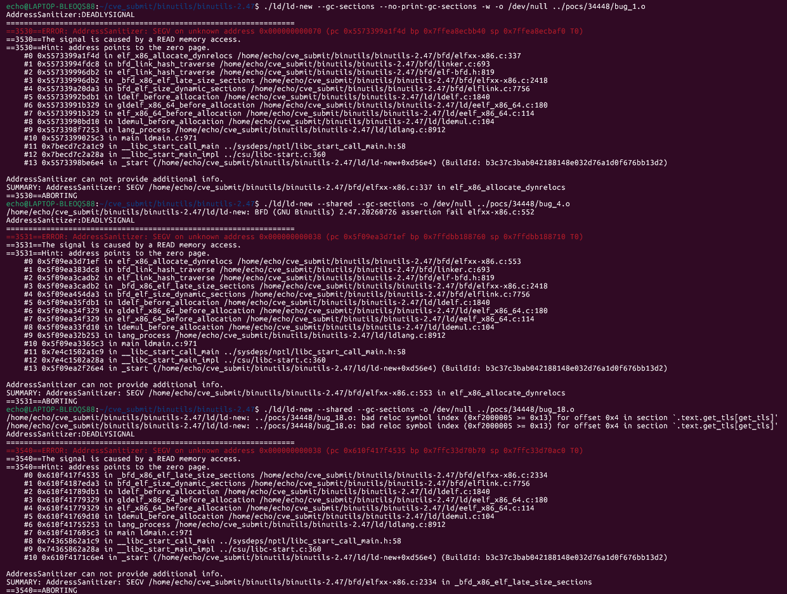

# 漏洞：GNU Binutils ld 在动态重定位尺寸计算时 `_bfd_x86_elf_late_size_sections` / `elf_x86_allocate_dynrelocs` 存在空指针解引用（NULL Dereference）

**项目：** GNU Binutils / GNU ld (https://sourceware.org/git/?p=binutils-gdb.git)
**版本：** 漏洞存在于 binutils 2.47（发布包版本日期 `20260726`）及开发快照 `2.47.50.20260722`（提交 `640a79623`），由 master 分支上的五个提交修复（目标里程碑 2.48，2026-08-06 标记 RESOLVED FIXED）
**日期：** 2026-07-28
**严重性：** 中危（MEDIUM）
**OWASP：** 不适用 - 原生二进制解析内存安全
**CWE：** CWE-476 - 空指针解引用

------

## 受影响文件

```text
bfd/elfxx-x86.c（`elf_x86_allocate_dynrelocs`、`_bfd_x86_elf_late_size_sections`）
bfd/elf32-i386.c、bfd/elf64-x86-64.c（重定位扫描与重定位校验）
ld/ldlang.c（`lang_init_start_stop`、`lang_gc_sections`）
bfd/elflink.c（`bfd_elf_gc_sections`）
```

## 根本原因

畸形输入驱动动态重定位尺寸计算时，x86 ELF 的 size-sections 路径解引用了 NULL 的 `htab`/`sreloc`（或等价指针）：

- `bug_1.o` 崩溃于 `elf_x86_allocate_dynrelocs()` 的 `bfd/elfxx-x86.c:337`（SEGV 读取 `0x70`）；
- `bug_4.o` 崩溃于同一函数的 `:553`（SEGV 读取 `0x38`）；
- `bug_18.o` 崩溃于其调用者 `_bfd_x86_elf_late_size_sections()` 的 `:2334`（SEGV 读取 `0x38`）。

三个 PoC 指向同一类根因：动态重定位分配期间节/`sreloc` 指针为 NULL 未被校验。上游（H.J. Lu）经五个提交从多个层面修复：

1. `d1268210b6f6` —— 不为被排除的节定义节符号：当节设置 `SEC_EXCLUDE` 位（例如 ELF 输入中 `SHF_EXCLUDE` 置位）时，仅为可重定位链接或该位被清除时才定义 `__start`、`__stop`、`.startof.`、`.sizeof.` 符号；
2. `471130b39c0` —— 校验非法的 GOT/PLT/TLS 重定位：对非分配（non-alloc）且非调试节中的 TLS/GOT/PLT 重定位报错；对非线程局部符号的 TLS 重定位报错；
3. `283d3198bed` —— 改进重定位错误报告：对 `bfd_reloc_outofrange` 报告 `out of section range`，而非晦涩的 `error 4`；
4. `0a84e560216` —— 检查所需动态重定位节是否已创建：`elf_link_read_relocs_from_section` 对坏重定位中止后，后续重定位不再处理、所需动态重定位节也不会被创建，此时跳过动态重定位计数；
5. `a692a633d40` —— 检查输入节垃圾回收错误：`bfd_elf_gc_sections` 在 `gc_mark_extra_sections` 返回 false 时返回 false，`lang_gc_sections` 检查返回值并报告致命错误（例如 `bad reloc symbol index ... in section '.text.get_tls[get_tls]'`）。

## 复现步骤

以下命令假定本报告的 `pocs` 目录与构建的 `binutils-gdb` 目录相邻：

```bash
git clone https://sourceware.org/git/binutils-gdb.git binutils-gdb
cd binutils-gdb
git checkout 640a79623
CC=gcc CFLAGS='-g -O1 -fsanitize=address -fno-omit-frame-pointer -fno-common' \
LDFLAGS='-fsanitize=address' \
./configure --disable-gdb --disable-gdbserver --disable-sim --disable-cet \
            --disable-werror --disable-nls --enable-targets=x86_64-linux-gnu MAKEINFO=true
make -j
```

binutils 2.47 发布包（版本日期 `20260726`）同样复现（三个 PoC 全部复现）。运行 PoC：

```bash
export ASAN_OPTIONS="abort_on_error=0:symbolize=1:detect_leaks=0:allocator_may_return_null=1:halt_on_error=1"
./ld/ld-new --gc-sections --no-print-gc-sections -w -o /dev/null ../pocs/34448/bug_1.o   # :337
./ld/ld-new --shared --gc-sections -o /dev/null ../pocs/34448/bug_4.o                   # :553
./ld/ld-new --shared --gc-sections -o /dev/null ../pocs/34448/bug_18.o                  # :2334
```

在漏洞版本上的预期结果：

bug_1（`:337`）：

```text
==64986==ERROR: AddressSanitizer: SEGV on unknown address 0x000000000070
The signal is caused by a READ memory access.
#0 elf_x86_allocate_dynrelocs       bfd/elfxx-x86.c:337
#1 bfd_link_hash_traverse           bfd/linker.c:693
#2 _bfd_x86_elf_late_size_sections  bfd/elfxx-x86.c:2418
#3 bfd_elf_size_dynamic_sections    bfd/elflink.c:7756
SUMMARY: AddressSanitizer: SEGV in elf_x86_allocate_dynrelocs
```

bug_4（`:553`）：

```text
==65031==ERROR: AddressSanitizer: SEGV on unknown address 0x000000000038
The signal is caused by a READ memory access.
#0 elf_x86_allocate_dynrelocs       bfd/elfxx-x86.c:553
SUMMARY: AddressSanitizer: SEGV in elf_x86_allocate_dynrelocs
```

bug_18（`:2334`）：

```text
==65836==ERROR: AddressSanitizer: SEGV on unknown address 0x000000000038
The signal is caused by a READ memory access.
#0 _bfd_x86_elf_late_size_sections  bfd/elfxx-x86.c:2334
#1 bfd_elf_size_dynamic_sections    bfd/elflink.c:7756
#2 ldelf_before_allocation          ld/ldelf.c:1840
SUMMARY: AddressSanitizer: SEGV in _bfd_x86_elf_late_size_sections
```



## 影响

精心构造的目标文件可在动态重定位尺寸计算阶段（`--gc-sections`/`--shared` 常规组合）使 `ld` 崩溃，造成拒绝服务。任何对不可信目标文件执行链接的构建服务、工具链或 CI 流水线都可能被该畸形输入终止。

## 建议修复

应用上游五个修复提交（`d1268210b6f6`、`471130b39c0`、`283d3198bed`、`0a84e560216`、`a692a633d40`），或升级到包含这些修复的 binutils 2.48 及以上版本。该系列修复在错误路径上补齐了节符号定义条件、GOT/PLT/TLS 重定位校验、动态重定位节存在性检查以及垃圾回收错误传播，使坏输入得到明确报错而非空指针解引用。

将这三个畸形样本（含非分配节重定位、越界重定位符号索引等场景）保留在 AddressSanitizer 回归覆盖中。

------

## 参考

- Bugzilla issue 34448：https://sourceware.org/bugzilla/show_bug.cgi?id=34448
- PoC 附件（bug_1）：https://sourceware.org/bugzilla/attachment.cgi?id=16878
- PoC 附件（bug_4）：https://sourceware.org/bugzilla/attachment.cgi?id=16879
- PoC 附件（bug_18）：https://sourceware.org/bugzilla/attachment.cgi?id=16880
- 修复提交 1：https://sourceware.org/git/gitweb.cgi?p=binutils-gdb.git;h=d1268210b6f6eddd267a4ebe4b7d36b802af628d
- 修复提交 2：https://sourceware.org/git/gitweb.cgi?p=binutils-gdb.git;h=471130b39c03623ec6d78ece377ff4da3f6bfe7b
- 修复提交 3：https://sourceware.org/git/gitweb.cgi?p=binutils-gdb.git;h=283d3198beda5110a8417fd09b336a34bbd2705c
- 修复提交 4：https://sourceware.org/git/gitweb.cgi?p=binutils-gdb.git;h=0a84e5602163e9f95a6f137ced28aff0507ce790
- 修复提交 5：https://sourceware.org/git/gitweb.cgi?p=binutils-gdb.git;h=a692a633d407995a5ce87e84a0b1032e9ac51360
- 漏洞版本：binutils 2.47（版本日期 20260726）/ 开发快照提交 640a79623
- Binutils 仓库：https://sourceware.org/git/?p=binutils-gdb.git
- 复现材料：https://github.com/Ech06/CVE_submit/tree/main/bugzilla/pocs/34448

## 备注

该 issue 已于 2026-08-06 被标记为 RESOLVED FIXED（目标里程碑 2.48），H.J. Lu 确认 "Fixed for 2.48"。修复跨五个提交完成，其中 `471130b39c0` 同时关联 PR ld/34444（`elf_x86_64_relocate_section` 的堆越界读写）。
