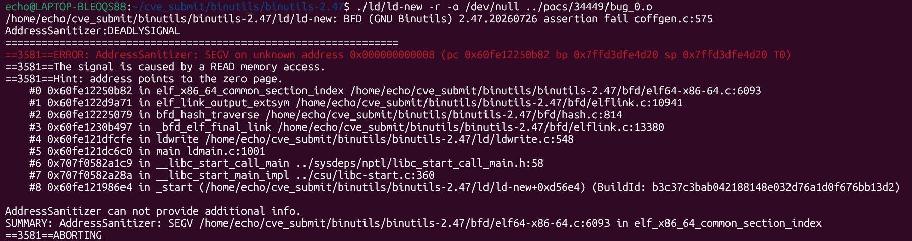

# 漏洞：GNU Binutils ld 在可重定位链接畸形公共符号时 `elf_x86_64_common_section_index` 存在空指针解引用（NULL Dereference）

**项目：** GNU Binutils / GNU ld (https://sourceware.org/git/?p=binutils-gdb.git)
**版本：** 漏洞存在于 binutils 2.47（发布包版本日期 `20260726`）及开发快照 `2.47.50.20260722`（提交 `640a79623`），由提交 `7322e9bc30cb282575a701c307851fd3d66fee68` 修复
**日期：** 2026-07-28
**严重性：** 中危（MEDIUM）
**OWASP：** 不适用 - 原生二进制解析内存安全
**CWE：** CWE-476 - 空指针解引用

------

## 受影响文件

```text
bfd/elf64-x86-64.c（`elf_x86_64_common_section_index`）
bfd/elflink.c（`elf_link_output_extsym`、`_bfd_elf_final_link`）
ld/ldwrite.c（`ldwrite`，通过 ld -r 的触发路径）
```

## 根本原因

在可重定位链接（`ld -r`）期间，`elf_link_output_extsym()` 经 `bfd_hash_traverse()` 被 `_bfd_elf_final_link()` 调用，为输出符号计算公共节索引时进入 `elf_x86_64_common_section_index()`。该函数无条件调用 `elf_section_flags(sec)` 读取节的 ELF 标志；当输入目标文件并非 ELF 格式（PoC 实为 PE/x86-64 COFF 对象）时，该节没有初始化的 ELF 专节数据，标志读取落在 NULL 附近的地址（`0x8`）上，产生 SEGV 读，使 `ld` 崩溃。

上游修复在读取 ELF 节标志之前先检查所属 BFD 的 flavour，非 ELF 输入直接返回 `SHN_COMMON`：

```diff
 static unsigned int
 elf_x86_64_common_section_index (asection *sec)
 {
-  if ((elf_section_flags (sec) & SHF_X86_64_LARGE) == 0)
+  if (bfd_get_flavour (sec->owner) != bfd_target_elf_flavour
+      || (elf_section_flags (sec) & SHF_X86_64_LARGE) == 0)
     return SHN_COMMON;
   else
     return SHN_X86_64_LCOMMON;
 }
```

修复后，链接器对这类输入在 `bfd/coffgen.c:575` 得到断言失败并正常报错退出，而不是发生段错误。

## 复现步骤

以下命令假定本报告的 `pocs` 目录与构建的 `binutils-gdb` 目录相邻：

```bash
git clone https://sourceware.org/git/binutils-gdb.git binutils-gdb
cd binutils-gdb
git checkout 640a79623
CC=gcc CFLAGS='-g -O1 -fsanitize=address -fno-omit-frame-pointer -fno-common' \
LDFLAGS='-fsanitize=address' \
./configure --disable-gdb --disable-gdbserver --disable-sim --disable-cet \
            --disable-werror --disable-nls --enable-targets=x86_64-linux-gnu MAKEINFO=true
make -j
```

binutils 2.47 发布包（版本日期 `20260726`）同样复现。运行 PoC：

```bash
export ASAN_OPTIONS="abort_on_error=0:symbolize=1:detect_leaks=0:allocator_may_return_null=1:halt_on_error=1"
./ld/ld-new -r -o /dev/null ../pocs/34449/bug_0.o
```

在漏洞版本上的预期结果：

```text
==64971==ERROR: AddressSanitizer: SEGV on unknown address 0x000000000008
The signal is caused by a READ memory access.
#0 elf_x86_64_common_section_index   bfd/elf64-x86-64.c:6093
#1 elf_link_output_extsym            bfd/elflink.c:10941
#2 bfd_hash_traverse                 bfd/hash.c:814
#3 _bfd_elf_final_link               bfd/elflink.c:13380
#4 ldwrite                           ld/ldwrite.c:548
SUMMARY: AddressSanitizer: SEGV in elf_x86_64_common_section_index
```



## 影响

精心构造的目标文件可在可重定位链接的符号输出阶段使 `ld` 崩溃，造成拒绝服务。任何将 GNU ld 暴露于不可信输入文件的工具链、构建系统或 CI 流水线都可能被该畸形公共符号输入终止。

## 建议修复

应用上游提交 `7322e9bc30cb282575a701c307851fd3d66fee68`（"x86-64: Return SHN_COMMON on non-ELF input"），或升级到包含该修复的 binutils 版本。该补丁使 x86-64 后端在节所属 BFD 非 ELF flavour 时不再访问 ELF 节标志，坏输入得到断言报错而非崩溃。

将混合格式（PE/x86-64）目标文件配合 `ld -r` 的用例保留在回归测试中，防止同类格式假设再次引入。

------

## 参考

- Bugzilla issue 34449：https://sourceware.org/bugzilla/show_bug.cgi?id=34449
- PoC 附件（bug_0）：https://sourceware.org/bugzilla/attachment.cgi?id=16881
- 修复提交：https://sourceware.org/git/gitweb.cgi?p=binutils-gdb.git;h=7322e9bc30cb282575a701c307851fd3d66fee68
- 漏洞版本：binutils 2.47（版本日期 20260726）/ 开发快照提交 640a79623
- Binutils 仓库：https://sourceware.org/git/?p=binutils-gdb.git
- 复现材料：https://github.com/Ech06/CVE_submit/tree/main/bugzilla/pocs/34449

## 备注

原始报告将该崩溃描述为对 NULL `sec` 的解引用；实际修复表明崩溃源于对非 ELF 节调用 `elf_section_flags()`（其 ELF 专节数据为 NULL），观察到的故障地址 `0x8` 与读取 NULL 结构成员偏移一致。修复提交由 H.J. Lu 于 2026-07-30 完成，2026-08-04 推送至 master。
