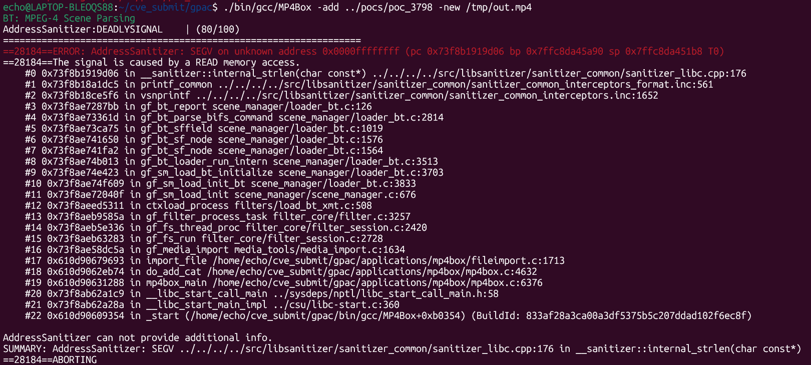

# Vuln: GPAC MP4Box Invalid Read in `gf_bt_report` While Parsing Malformed BT/BIFS

**Project:** GPAC (https://github.com/gpac/gpac)  
**Version:** Vulnerable at commit `f1219cde1a892a913ec85d7fd97324ece94c2d15`, fixed by commit `afca1f1181668d85941d51ed1adf647807d5d975`  
**Date:** 2026-07-27  
**Severity:** MEDIUM  
**OWASP:** N/A - Native File Parsing Memory Safety  
**CWE:** CWE-685 - Function Call With Incorrect Number of Arguments  

---

## Affected File

```text
src/scene_manager/loader_bt.c (`gf_bt_report` and `gf_bt_parse_bifs_command`)
applications/mp4box/fileimport.c (trigger path through MP4Box -add)
```

## Root Cause

When a malformed BT/BIFS command reaches the unknown-command error path, `gf_bt_parse_bifs_command()` passes a format string containing `%s` to `gf_bt_report()` without supplying the corresponding string argument. `gf_bt_report()` forwards the invalid variadic arguments to `vsnprintf()`, which treats an unrelated value as a string pointer. AddressSanitizer consequently reports an invalid read in `strlen()`.

The upstream fix supplies the missing argument and corrects the message text:

```diff
-return gf_bt_report(parser, GF_BAD_PARAM, "%s: Unknown command syntax, str");
+return gf_bt_report(parser, GF_BAD_PARAM, "%s: Unknown command syntax", str);
```

## Steps to Reproduce

The following commands assume that this report's `pocs` directory is next to the cloned `gpac` directory:

```bash
git clone https://github.com/gpac/gpac.git gpac
cd gpac
git checkout f1219cde
./configure --enable-sanitizer --static-mp4box
make -j"$(nproc)"
./bin/gcc/MP4Box -add ../pocs/poc_3798 -new /tmp/out.mp4
```

Expected result on the vulnerable commit:

```text
AddressSanitizer:DEADLYSIGNAL
ERROR: AddressSanitizer: SEGV on unknown address 0x0000ffffffff
The signal is caused by a READ memory access.
#0 __sanitizer::internal_strlen(char const*)
#3 gf_bt_report                         scene_manager/loader_bt.c:126
#4 gf_bt_parse_bifs_command             scene_manager/loader_bt.c:2814
SUMMARY: AddressSanitizer: SEGV in __sanitizer::internal_strlen(char const*)
```



## Impact

A crafted BT/BIFS scene can crash `MP4Box` during import, causing denial of service. Applications or automated media pipelines that invoke the affected GPAC scene parser on attacker-controlled input are also exposed to the invalid read.

## Recommended Fix

Apply upstream commit `afca1f1181668d85941d51ed1adf647807d5d975` or upgrade to a later GPAC revision. The patch corrects the variadic function call so the `%s` conversion receives the intended command string.

Keep malformed BT/BIFS inputs in AddressSanitizer regression coverage, including error-reporting paths that use variadic formatting.

---

## References

- GPAC issue #3798: https://github.com/gpac/gpac/issues/3798
- Fix commit: https://github.com/gpac/gpac/commit/afca1f1181668d85941d51ed1adf647807d5d975
- Vulnerable commit: https://github.com/gpac/gpac/commit/f1219cde1a892a913ec85d7fd97324ece94c2d15
- GPAC repository: https://github.com/gpac/gpac
- Reproduction materials: https://github.com/Ech06/CVE_submit

## Notes

GitHub issue #3798 was closed by the fix commit. Although the issue title describes a NULL dereference, the observed address is an invalid string pointer produced by a missing variadic argument; CWE-685 describes the underlying defect more precisely.
