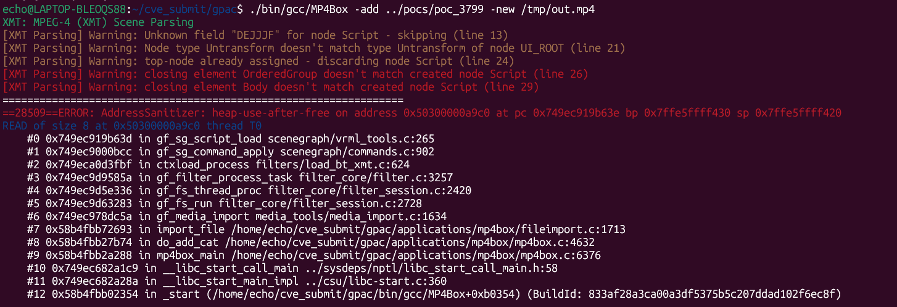

# Vuln: GPAC MP4Box Heap Use-After-Free in `gf_sg_script_load`

**Project:** GPAC (https://github.com/gpac/gpac)  
**Version:** Vulnerable at commit `f1219cde1a892a913ec85d7fd97324ece94c2d15`, fixed by commit `9eb40df4448b88d6a6ce3454657c06f47eff0b24`  
**Date:** 2026-07-27  
**Severity:** HIGH  
**OWASP:** N/A - Native File Parsing Memory Corruption  
**CWE:** CWE-416 - Use After Free  

---

## Affected File

```text
src/scene_manager/loader_xmt.c (`xmt_node_end`)
src/scenegraph/vrml_tools.c (`gf_sg_script_load`)
src/scenegraph/commands.c (`gf_sg_command_apply`)
```

## Root Cause

While parsing malformed XMT, `xmt_node_end()` can discard and unregister a `Script` node but continue processing the same pointer. The freed node is then appended to `command->scripts_to_load`. When the scene command is applied, `gf_sg_command_apply()` calls `gf_sg_script_load()` with that dangling pointer, producing a heap-use-after-free read.

The upstream fix records whether a node was discarded and prevents it from being queued for later script loading:

```diff
+Bool node_discarded = GF_FALSE;
 ...
 gf_node_unregister(node, NULL);
+node_discarded = GF_TRUE;
 ...
-if (!top || (top->node != node)) {
+if (!node_discarded && (!top || (top->node != node))) {
```

## Steps to Reproduce

The following commands assume that this report's `pocs` directory is next to the cloned `gpac` directory:

```bash
git clone https://github.com/gpac/gpac.git gpac
cd gpac
git checkout f1219cde
./configure --enable-sanitizer --static-mp4box
make -j"$(nproc)"
./bin/gcc/MP4Box -add ../pocs/poc_3799 -new /tmp/out.mp4
```

Expected result on the vulnerable commit:

```text
ERROR: AddressSanitizer: heap-use-after-free
READ of size 8
#0 gf_sg_script_load                   scenegraph/vrml_tools.c:265
#1 gf_sg_command_apply                 scenegraph/commands.c:902
#2 ctxload_process                     filters/load_bt_xmt.c:624
freed by:
    gf_node_unregister                 scenegraph/base_scenegraph.c:801
    xmt_node_end                       scene_manager/loader_xmt.c:3203
SUMMARY: AddressSanitizer: heap-use-after-free in gf_sg_script_load
```



## Impact

A crafted XMT scene can make `MP4Box` dereference a freed scene node, reliably crashing the process. Because this is a heap lifetime violation involving attacker-controlled scene structure, memory corruption beyond denial of service may be possible depending on allocator state and embedding context.

## Recommended Fix

Apply upstream commit `9eb40df4448b88d6a6ce3454657c06f47eff0b24` or upgrade to a later GPAC revision. The patch tracks discarded nodes and excludes them from deferred script loading.

Add the malformed XMT sample to AddressSanitizer regression tests and verify both parsing and deferred scene-command application.

---

## References

- GPAC issue #3799: https://github.com/gpac/gpac/issues/3799
- Fix commit: https://github.com/gpac/gpac/commit/9eb40df4448b88d6a6ce3454657c06f47eff0b24
- Related earlier issue #3647: https://github.com/gpac/gpac/issues/3647
- Vulnerable commit: https://github.com/gpac/gpac/commit/f1219cde1a892a913ec85d7fd97324ece94c2d15
- GPAC repository: https://github.com/gpac/gpac
- Reproduction materials: https://github.com/Ech06/CVE_submit

## Notes

The original report notes that this behavior may represent an incomplete fix for issue #3647. Issue #3799 was closed directly by commit `9eb40df4448b88d6a6ce3454657c06f47eff0b24`.
