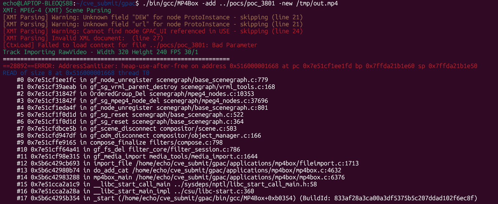

# Vuln: GPAC MP4Box Heap Use-After-Free in `gf_node_unregister` During XMT Teardown

**Project:** GPAC (https://github.com/gpac/gpac)  
**Version:** Vulnerable at commit `f1219cde1a892a913ec85d7fd97324ece94c2d15`, fixed by commit `9eb40df4448b88d6a6ce3454657c06f47eff0b24`  
**Date:** 2026-07-27  
**Severity:** HIGH  
**OWASP:** N/A - Native File Parsing Memory Corruption  
**CWE:** CWE-416 - Use After Free  

---

## Affected File

```text
src/scene_manager/loader_xmt.c (malformed ProtoDeclare handling)
src/scenegraph/base_scenegraph.c (prototype default-node cleanup)
src/scenegraph/vrml_tools.c (`gf_sg_vrml_parent_destroy`)
src/scenegraph/vrml_proto.c (prototype destruction)
```

## Root Cause

A malformed XMT document can nest or prematurely terminate a `ProtoDeclare`, leaving prototype default-node references attached to an inconsistent scene graph. The prototype subgraph is freed during failed-load cleanup, but an `OrderedGroup` child path later tries to unregister a node through the stale graph state. AddressSanitizer reports the resulting heap-use-after-free in `gf_node_unregister()` via `gf_sg_vrml_parent_destroy()` and `OrderedGroup_Del()`.

The upstream fix rejects a nested prototype declaration and explicitly unregisters prototype SFNode/MFNode default values while their owner is still valid:

```diff
+if (parent && parent->node) {
+    xmt_report(parser, GF_BAD_PARAM,
+               "ProtoDeclare cannot be nested inside a node - skipping");
+    return NULL;
+}
```

```diff
+static void drop_proto_default_field_nodes(GF_Proto *p)
+{
+    ...
+    gf_node_unregister(field->def_sfnode_value, NULL);
+    ...
+    gf_node_unregister_children(NULL, field->def_mfnode_value);
+}
```

## Steps to Reproduce

The following commands assume that this report's `pocs` directory is next to the cloned `gpac` directory:

```bash
git clone https://github.com/gpac/gpac.git gpac
cd gpac
git checkout f1219cde
./configure --enable-sanitizer --static-mp4box
make -j"$(nproc)"
./bin/gcc/MP4Box -add ../pocs/poc_3801 -new /tmp/out.mp4
```

Expected result on the vulnerable commit:

```text
ERROR: AddressSanitizer: heap-use-after-free
READ of size 8
#0 gf_node_unregister                   scenegraph/base_scenegraph.c:779
#1 gf_sg_vrml_parent_destroy           scenegraph/vrml_tools.c:168
#2 OrderedGroup_Del                     scenegraph/mpeg4_nodes.c:10353
#5 gf_sg_reset                          scenegraph/base_scenegraph.c:522
freed by:
    gf_sg_proto_del                     scenegraph/vrml_proto.c:155
    gf_sg_command_del                   scenegraph/commands.c:131
SUMMARY: AddressSanitizer: heap-use-after-free in gf_node_unregister
```



## Impact

A crafted XMT scene can leave dangling prototype and child-node references and crash `MP4Box` during scene teardown. This enables denial of service in applications that import attacker-controlled XMT content. The heap-use-after-free may permit more severe memory corruption depending on how GPAC is embedded and how the freed region is reused.

## Recommended Fix

Apply upstream commit `9eb40df4448b88d6a6ce3454657c06f47eff0b24` or upgrade to a later GPAC revision. The fix rejects invalid nested prototype declarations and cleans up prototype default-node ownership before subgraph destruction.

Keep malformed prototype nesting and early XML termination cases in AddressSanitizer regression tests.

---

## References

- GPAC issue #3801: https://github.com/gpac/gpac/issues/3801
- Fix commit: https://github.com/gpac/gpac/commit/9eb40df4448b88d6a6ce3454657c06f47eff0b24
- Earlier related fix: https://github.com/gpac/gpac/commit/41ce91ded3aad83ca7139bd00e3ee9ff4cd7796a
- Related issue #3805: https://github.com/gpac/gpac/issues/3805
- Vulnerable commit: https://github.com/gpac/gpac/commit/f1219cde1a892a913ec85d7fd97324ece94c2d15
- GPAC repository: https://github.com/gpac/gpac
- Reproduction materials: https://github.com/Ech06/CVE_submit

## Notes

The original report identifies the issue as a possible incomplete fix related to commit `41ce91ded3aad83ca7139bd00e3ee9ff4cd7796a`. Issue #3801 was also cross-referenced by issue #3805 and was closed directly by commit `9eb40df4448b88d6a6ce3454657c06f47eff0b24`.
