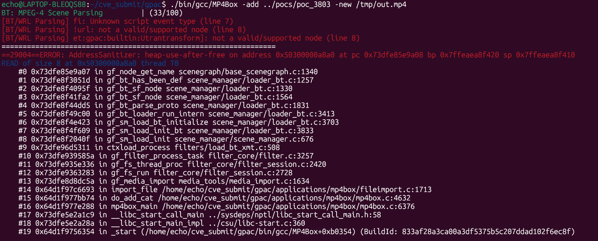

# Vuln: GPAC MP4Box Heap Use-After-Free in `gf_node_get_name` During DEF Resolution

**Project:** GPAC (https://github.com/gpac/gpac)  
**Version:** Vulnerable at commit `f1219cde1a892a913ec85d7fd97324ece94c2d15`, fixed by commit `9eb40df4448b88d6a6ce3454657c06f47eff0b24`  
**Date:** 2026-07-27  
**Severity:** HIGH  
**OWASP:** N/A - Native File Parsing Memory Corruption  
**CWE:** CWE-416 - Use After Free  

---

## Affected File

```text
src/scene_manager/loader_bt.c (`gf_bt_sf_node`, `gf_bt_has_been_def`)
src/scenegraph/base_scenegraph.c (`gf_node_get_name`)
applications/mp4box/fileimport.c (trigger path through MP4Box -add)
```

## Root Cause

When `gf_bt_sf_node()` fails while parsing a malformed node, its error path unregisters and frees the partially constructed node but leaves the same pointer in `parser->def_nodes`. Later DEF/USE resolution walks that list through `gf_bt_has_been_def()` and calls `gf_node_get_name()` on the dangling pointer, causing a heap-use-after-free read.

The upstream fix removes the failed node from the DEF-node list before unregistering it:

```diff
 err:
+    gf_list_del_item(parser->def_nodes, node);
     gf_node_unregister(node, parent);
     if (name) gf_free(name);
     return NULL;
```

## Steps to Reproduce

The following commands assume that this report's `pocs` directory is next to the cloned `gpac` directory:

```bash
git clone https://github.com/gpac/gpac.git gpac
cd gpac
git checkout f1219cde
./configure --enable-sanitizer --static-mp4box
make -j"$(nproc)"
./bin/gcc/MP4Box -add ../pocs/poc_3803 -new /tmp/out.mp4
```

Expected result on the vulnerable commit:

```text
ERROR: AddressSanitizer: heap-use-after-free
READ of size 8
#0 gf_node_get_name                    scenegraph/base_scenegraph.c:1340
#1 gf_bt_has_been_def                  scene_manager/loader_bt.c:1257
#2 gf_bt_sf_node                       scene_manager/loader_bt.c:1330
freed by:
    gf_node_unregister                 scenegraph/base_scenegraph.c:801
    gf_bt_sf_node                      scene_manager/loader_bt.c:1616
SUMMARY: AddressSanitizer: heap-use-after-free in gf_node_get_name
```



## Impact

A crafted BT scene can leave a dangling entry in the parser's DEF-node table and crash `MP4Box` during name resolution. This creates a denial-of-service condition for media import workflows processing untrusted scenes. Because the stale pointer references attacker-influenced heap state, more severe memory corruption may be possible in some environments.

## Recommended Fix

Apply upstream commit `9eb40df4448b88d6a6ce3454657c06f47eff0b24` or upgrade to a later GPAC revision. The patch keeps the DEF-node registry consistent with node lifetime by deleting failed nodes before they are freed.

Regression coverage should include malformed DEF/USE and PROTO inputs that exercise parser error cleanup followed by additional name lookups.

---

## References

- GPAC issue #3803: https://github.com/gpac/gpac/issues/3803
- Fix commit: https://github.com/gpac/gpac/commit/9eb40df4448b88d6a6ce3454657c06f47eff0b24
- Related earlier issue #3642: https://github.com/gpac/gpac/issues/3642
- Vulnerable commit: https://github.com/gpac/gpac/commit/f1219cde1a892a913ec85d7fd97324ece94c2d15
- GPAC repository: https://github.com/gpac/gpac
- Reproduction materials: https://github.com/Ech06/CVE_submit

## Notes

The original report notes that this behavior may represent an incomplete fix for issue #3642. Issue #3803 was closed directly by commit `9eb40df4448b88d6a6ce3454657c06f47eff0b24`.
