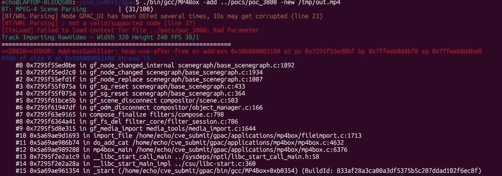
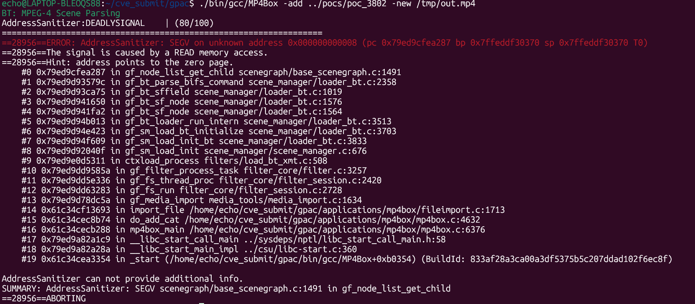

https://github.com/gpac/gpac/issues/3798

https://github.com/gpac/gpac/issues/3799

https://github.com/gpac/gpac/issues/3800

https://github.com/gpac/gpac/issues/3801

https://github.com/gpac/gpac/issues/3802

https://github.com/gpac/gpac/issues/3803

https://github.com/Ech06/CVE_submit.git

```
git checkout f1219cde
./configure --enable-sanitizer --static-mp4box
make -j$(nproc)
./bin/gcc/MP4Box -add ../pocs/poc_3798 -new /tmp/out.mp4
```

```
BT: MPEG-4 Scene Parsing
AddressSanitizer:DEADLYSIGNAL    | (80/100)
=================================================================
==28184==ERROR: AddressSanitizer: SEGV on unknown address 0x0000ffffffff (pc 0x73f8b1919d06 bp 0x7ffc8da45a90 sp 0x7ffc8da451b8 T0)
==28184==The signal is caused by a READ memory access.
    #0 0x73f8b1919d06 in __sanitizer::internal_strlen(char const*) ../../../../src/libsanitizer/sanitizer_common/sanitizer_libc.cpp:176
    #1 0x73f8b18a1dc5 in printf_common ../../../../src/libsanitizer/sanitizer_common/sanitizer_common_interceptors_format.inc:561
    #2 0x73f8b18ce5f6 in vsnprintf ../../../../src/libsanitizer/sanitizer_common/sanitizer_common_interceptors.inc:1652
    #3 0x73f8ae7287bb in gf_bt_report scene_manager/loader_bt.c:126
    #4 0x73f8ae73361d in gf_bt_parse_bifs_command scene_manager/loader_bt.c:2814
    #5 0x73f8ae73ca75 in gf_bt_sffield scene_manager/loader_bt.c:1019
    #6 0x73f8ae741650 in gf_bt_sf_node scene_manager/loader_bt.c:1576
    #7 0x73f8ae741fa2 in gf_bt_sf_node scene_manager/loader_bt.c:1564
    #8 0x73f8ae74b013 in gf_bt_loader_run_intern scene_manager/loader_bt.c:3513
    #9 0x73f8ae74e423 in gf_sm_load_bt_initialize scene_manager/loader_bt.c:3703
    #10 0x73f8ae74f609 in gf_sm_load_init_bt scene_manager/loader_bt.c:3833
    #11 0x73f8ae72040f in gf_sm_load_init scene_manager/scene_manager.c:676
    #12 0x73f8aeed5311 in ctxload_process filters/load_bt_xmt.c:508
    #13 0x73f8aeb9585a in gf_filter_process_task filter_core/filter.c:3257
    #14 0x73f8aeb5e336 in gf_fs_thread_proc filter_core/filter_session.c:2420
    #15 0x73f8aeb63283 in gf_fs_run filter_core/filter_session.c:2728
    #16 0x73f8ae58dc5a in gf_media_import media_tools/media_import.c:1634
    #17 0x610d90679693 in import_file /home/echo/cve_submit/gpac/applications/mp4box/fileimport.c:1713
    #18 0x610d9062eb74 in do_add_cat /home/echo/cve_submit/gpac/applications/mp4box/mp4box.c:4632
    #19 0x610d90631288 in mp4box_main /home/echo/cve_submit/gpac/applications/mp4box/mp4box.c:6376
    #20 0x73f8ab62a1c9 in __libc_start_call_main ../sysdeps/nptl/libc_start_call_main.h:58
    #21 0x73f8ab62a28a in __libc_start_main_impl ../csu/libc-start.c:360
    #22 0x610d90609354 in _start (/home/echo/cve_submit/gpac/bin/gcc/MP4Box+0xb0354) (BuildId: 833af28a3ca00a3df5375b5c207ddad102f6ec8f)

AddressSanitizer can not provide additional info.
SUMMARY: AddressSanitizer: SEGV ../../../../src/libsanitizer/sanitizer_common/sanitizer_libc.cpp:176 in __sanitizer::internal_strlen(char const*)
==28184==ABORTING
```


```
git checkout f1219cde
./configure --enable-sanitizer --static-mp4box
make -j$(nproc)
./bin/gcc/MP4Box -add ../pocs/poc_3799 -new /tmp/out.mp4
```

```XMT: MPEG-4 (XMT) Scene Parsing
[XMT Parsing] Warning: Unknown field "DEJJJF" for node Script - skipping (line 13)
[XMT Parsing] Warning: Node type Untransform doesn't match type Untransform of node UI_ROOT (line 21)
[XMT Parsing] Warning: top-node already assigned - discarding node Script (line 24)
[XMT Parsing] Warning: closing element OrderedGroup doesn't match created node Script (line 26)
[XMT Parsing] Warning: closing element Body doesn't match created node Script (line 29)
=================================================================
==28509==ERROR: AddressSanitizer: heap-use-after-free on address 0x50300000a9c0 at pc 0x749ec919b63e bp 0x7ffe5ffff430 sp 0x7ffe5ffff420
READ of size 8 at 0x50300000a9c0 thread T0
    #0 0x749ec919b63d in gf_sg_script_load scenegraph/vrml_tools.c:265
    #1 0x749ec9000bcc in gf_sg_command_apply scenegraph/commands.c:902
    #2 0x749eca0d3fbf in ctxload_process filters/load_bt_xmt.c:624
    #3 0x749ec9d9585a in gf_filter_process_task filter_core/filter.c:3257
    #4 0x749ec9d5e336 in gf_fs_thread_proc filter_core/filter_session.c:2420
    #5 0x749ec9d63283 in gf_fs_run filter_core/filter_session.c:2728
    #6 0x749ec978dc5a in gf_media_import media_tools/media_import.c:1634
    #7 0x58b4fbb72693 in import_file /home/echo/cve_submit/gpac/applications/mp4box/fileimport.c:1713
    #8 0x58b4fbb27b74 in do_add_cat /home/echo/cve_submit/gpac/applications/mp4box/mp4box.c:4632
    #9 0x58b4fbb2a288 in mp4box_main /home/echo/cve_submit/gpac/applications/mp4box/mp4box.c:6376
    #10 0x749ec682a1c9 in __libc_start_call_main ../sysdeps/nptl/libc_start_call_main.h:58
    #11 0x749ec682a28a in __libc_start_main_impl ../csu/libc-start.c:360
    #12 0x58b4fbb02354 in _start (/home/echo/cve_submit/gpac/bin/gcc/MP4Box+0xb0354) (BuildId: 833af28a3ca00a3df5375b5c207ddad102f6ec8f)

0x50300000a9c0 is located 0 bytes inside of 32-byte region [0x50300000a9c0,0x50300000a9e0)
freed by thread T0 here:
    #0 0x749eccafc4d8 in free ../../../../src/libsanitizer/asan/asan_malloc_linux.cpp:52
    #1 0x749ec8feda4f in gf_node_unregister scenegraph/base_scenegraph.c:801
    #2 0x749ec9960ee5 in xmt_node_end scene_manager/loader_xmt.c:3203
    #3 0x749ec8ee1a7b in xml_sax_node_end utils/xml_parser.c:265
    #4 0x749ec8ee4be1 in xml_sax_parse utils/xml_parser.c:867
    #5 0x749ec8ee78b2 in gf_xml_sax_parse_intern utils/xml_parser.c:1110
    #6 0x749ec8ee7c17 in gf_xml_sax_parse utils/xml_parser.c:1138
    #7 0x749ec8ee7f30 in xml_sax_read_file utils/xml_parser.c:1225
    #8 0x749ec8ee8ecb in gf_xml_sax_parse_file utils/xml_parser.c:1338
    #9 0x749ec995c396 in load_xmt_run scene_manager/loader_xmt.c:3599
    #10 0x749eca0d5887 in ctxload_process filters/load_bt_xmt.c:522
    #11 0x749ec9d9585a in gf_filter_process_task filter_core/filter.c:3257
    #12 0x749ec9d5e336 in gf_fs_thread_proc filter_core/filter_session.c:2420
    #13 0x749ec9d63283 in gf_fs_run filter_core/filter_session.c:2728
    #14 0x749ec978dc5a in gf_media_import media_tools/media_import.c:1634
    #15 0x58b4fbb72693 in import_file /home/echo/cve_submit/gpac/applications/mp4box/fileimport.c:1713
    #16 0x58b4fbb27b74 in do_add_cat /home/echo/cve_submit/gpac/applications/mp4box/mp4box.c:4632
    #17 0x58b4fbb2a288 in mp4box_main /home/echo/cve_submit/gpac/applications/mp4box/mp4box.c:6376
    #18 0x749ec682a1c9 in __libc_start_call_main ../sysdeps/nptl/libc_start_call_main.h:58
    #19 0x749ec682a28a in __libc_start_main_impl ../csu/libc-start.c:360
    #20 0x58b4fbb02354 in _start (/home/echo/cve_submit/gpac/bin/gcc/MP4Box+0xb0354) (BuildId: 833af28a3ca00a3df5375b5c207ddad102f6ec8f)

previously allocated by thread T0 here:
    #0 0x749eccafd9c7 in malloc ../../../../src/libsanitizer/asan/asan_malloc_linux.cpp:69
    #1 0x749ec9113611 in Script_Create scenegraph/mpeg4_nodes.c:12857
    #2 0x749ec9113611 in gf_sg_mpeg4_node_new scenegraph/mpeg4_nodes.c:36866
    #3 0x749ec8feed5e in gf_node_new scenegraph/base_scenegraph.c:2079
    #4 0x749ec996a066 in xmt_parse_element scene_manager/loader_xmt.c:1967
    #5 0x749ec996f4c5 in xmt_node_start scene_manager/loader_xmt.c:2892
    #6 0x749ec8ee2735 in xml_sax_node_start utils/xml_parser.c:308
    #7 0x749ec8ee5dbb in xml_sax_parse_attribute utils/xml_parser.c:397
    #8 0x749ec8ee5dbb in xml_sax_parse utils/xml_parser.c:940
    #9 0x749ec8ee78b2 in gf_xml_sax_parse_intern utils/xml_parser.c:1110
    #10 0x749ec8ee7c17 in gf_xml_sax_parse utils/xml_parser.c:1138
    #11 0x749ec8ee7f30 in xml_sax_read_file utils/xml_parser.c:1225
    #12 0x749ec8ee8ecb in gf_xml_sax_parse_file utils/xml_parser.c:1338
    #13 0x749ec995c396 in load_xmt_run scene_manager/loader_xmt.c:3599
    #14 0x749eca0d5887 in ctxload_process filters/load_bt_xmt.c:522
    #15 0x749ec9d9585a in gf_filter_process_task filter_core/filter.c:3257
    #16 0x749ec9d5e336 in gf_fs_thread_proc filter_core/filter_session.c:2420
    #17 0x749ec9d63283 in gf_fs_run filter_core/filter_session.c:2728
    #18 0x749ec978dc5a in gf_media_import media_tools/media_import.c:1634
    #19 0x58b4fbb72693 in import_file /home/echo/cve_submit/gpac/applications/mp4box/fileimport.c:1713
    #20 0x58b4fbb27b74 in do_add_cat /home/echo/cve_submit/gpac/applications/mp4box/mp4box.c:4632
    #21 0x58b4fbb2a288 in mp4box_main /home/echo/cve_submit/gpac/applications/mp4box/mp4box.c:6376
    #22 0x749ec682a1c9 in __libc_start_call_main ../sysdeps/nptl/libc_start_call_main.h:58
    #23 0x749ec682a28a in __libc_start_main_impl ../csu/libc-start.c:360
    #24 0x58b4fbb02354 in _start (/home/echo/cve_submit/gpac/bin/gcc/MP4Box+0xb0354) (BuildId: 833af28a3ca00a3df5375b5c207ddad102f6ec8f)

SUMMARY: AddressSanitizer: heap-use-after-free scenegraph/vrml_tools.c:265 in gf_sg_script_load
Shadow bytes around the buggy address:
  0x50300000a700: 00 fa fa fa 00 00 00 fa fa fa 00 00 00 fa fa fa
  0x50300000a780: 00 00 00 00 fa fa 00 00 00 fa fa fa 00 00 01 fa
  0x50300000a800: fa fa fd fd fd fa fa fa fd fd fd fa fa fa fd fd
  0x50300000a880: fd fd fa fa 00 00 00 fa fa fa fd fd fd fd fa fa
  0x50300000a900: 00 00 00 00 fa fa fd fd fd fd fa fa 00 00 00 fa
=>0x50300000a980: fa fa 00 00 00 00 fa fa[fd]fd fd fd fa fa 00 00
  0x50300000aa00: 00 00 fa fa fa fa fa fa fa fa fa fa fa fa fa fa
  0x50300000aa80: fa fa fa fa fa fa fa fa fa fa fa fa fa fa fa fa
  0x50300000ab00: fa fa fa fa fa fa fa fa fa fa fa fa fa fa fa fa
  0x50300000ab80: fa fa fa fa fa fa fa fa fa fa fa fa fa fa fa fa
  0x50300000ac00: fa fa fa fa fa fa fa fa fa fa fa fa fa fa fa fa
Shadow byte legend (one shadow byte represents 8 application bytes):
  Addressable:           00
  Partially addressable: 01 02 03 04 05 06 07
  Heap left redzone:       fa
  Freed heap region:       fd
  Stack left redzone:      f1
  Stack mid redzone:       f2
  Stack right redzone:     f3
  Stack after return:      f5
  Stack use after scope:   f8
  Global redzone:          f9
  Global init order:       f6
  Poisoned by user:        f7
  Container overflow:      fc
  Array cookie:            ac
  Intra object redzone:    bb
  ASan internal:           fe
  Left alloca redzone:     ca
  Right alloca redzone:    cb
==28509==ABORTING
```


```
git checkout f1219cde
./configure --enable-sanitizer --static-mp4box
make -j$(nproc)
./bin/gcc/MP4Box -add ../pocs/poc_3800 -new /tmp/out.mp4
```

```BT: MPEG-4 Scene Parsing         | (31/100)
[BT/WRL Parsing] Node GPAC_UI has been DEFed several times, IDs may get corrupted (line 23)
[BT/WRL Parsing] : not a valid/supported node (line 37)
[CtxLoad] Failed to load context for file ../pocs/poc_3800: Bad Parameter
Track Importing RawVideo - Width 320 Height 240 FPS 30/1
=================================================================
==28828==ERROR: AddressSanitizer: heap-use-after-free on address 0x506000002180 at pc 0x7295f55ed0bf bp 0x7ffeeb0d4bf0 sp 0x7ffeeb0d4be0
READ of size 8 at 0x506000002180 thread T0
    #0 0x7295f55ed0be in gf_node_changed_internal scenegraph/base_scenegraph.c:1892
    #1 0x7295f55ed2c0 in gf_node_changed scenegraph/base_scenegraph.c:1934
    #2 0x7295f55efd1f in gf_node_replace scenegraph/base_scenegraph.c:1007
    #3 0x7295f55f075a in gf_sg_reset scenegraph/base_scenegraph.c:433
    #4 0x7295f55f075a in gf_sg_reset scenegraph/base_scenegraph.c:364
    #5 0x7295f61bce5b in gf_scene_disconnect compositor/scene.c:503
    #6 0x7295f61947df in gf_odm_disconnect compositor/object_manager.c:166
    #7 0x7295f63e9165 in compose_finalize filters/compose.c:798
    #8 0x7295f6364a41 in gf_fs_del filter_core/filter_session.c:786
    #9 0x7295f5d8e315 in gf_media_import media_tools/media_import.c:1644
    #10 0x5a69ae9d1693 in import_file /home/echo/cve_submit/gpac/applications/mp4box/fileimport.c:1713
    #11 0x5a69ae986b74 in do_add_cat /home/echo/cve_submit/gpac/applications/mp4box/mp4box.c:4632
    #12 0x5a69ae989288 in mp4box_main /home/echo/cve_submit/gpac/applications/mp4box/mp4box.c:6376
    #13 0x7295f2e2a1c9 in __libc_start_call_main ../sysdeps/nptl/libc_start_call_main.h:58
    #14 0x7295f2e2a28a in __libc_start_main_impl ../csu/libc-start.c:360
    #15 0x5a69ae961354 in _start (/home/echo/cve_submit/gpac/bin/gcc/MP4Box+0xb0354) (BuildId: 833af28a3ca00a3df5375b5c207ddad102f6ec8f)

0x506000002180 is located 0 bytes inside of 64-byte region [0x506000002180,0x5060000021c0)
freed by thread T0 here:
    #0 0x7295f90fc4d8 in free ../../../../src/libsanitizer/asan/asan_malloc_linux.cpp:52
    #1 0x7295f5753805 in gf_sg_proto_del_instance scenegraph/vrml_proto.c:927
    #2 0x7295f55eda4f in gf_node_unregister scenegraph/base_scenegraph.c:801
    #3 0x7295f575ea6b in Script_PreDestroy scenegraph/vrml_script.c:59
    #4 0x7295f575ea6b in Script_PreDestroy scenegraph/vrml_script.c:40
    #5 0x7295f55eb038 in gf_node_free scenegraph/base_scenegraph.c:1637
    #6 0x7295f55eda4f in gf_node_unregister scenegraph/base_scenegraph.c:801
    #7 0x7295f55efd10 in gf_node_replace scenegraph/base_scenegraph.c:1005
    #8 0x7295f55f075a in gf_sg_reset scenegraph/base_scenegraph.c:433
    #9 0x7295f55f075a in gf_sg_reset scenegraph/base_scenegraph.c:364
    #10 0x7295f61bce5b in gf_scene_disconnect compositor/scene.c:503
    #11 0x7295f61947df in gf_odm_disconnect compositor/object_manager.c:166
    #12 0x7295f63e9165 in compose_finalize filters/compose.c:798
    #13 0x7295f6364a41 in gf_fs_del filter_core/filter_session.c:786
    #14 0x7295f5d8e315 in gf_media_import media_tools/media_import.c:1644
    #15 0x5a69ae9d1693 in import_file /home/echo/cve_submit/gpac/applications/mp4box/fileimport.c:1713
    #16 0x5a69ae986b74 in do_add_cat /home/echo/cve_submit/gpac/applications/mp4box/mp4box.c:4632
    #17 0x5a69ae989288 in mp4box_main /home/echo/cve_submit/gpac/applications/mp4box/mp4box.c:6376
    #18 0x7295f2e2a1c9 in __libc_start_call_main ../sysdeps/nptl/libc_start_call_main.h:58
    #19 0x7295f2e2a28a in __libc_start_main_impl ../csu/libc-start.c:360
    #20 0x5a69ae961354 in _start (/home/echo/cve_submit/gpac/bin/gcc/MP4Box+0xb0354) (BuildId: 833af28a3ca00a3df5375b5c207ddad102f6ec8f)

previously allocated by thread T0 here:
    #0 0x7295f90fd9c7 in malloc ../../../../src/libsanitizer/asan/asan_malloc_linux.cpp:69
    #1 0x7295f57523c5 in gf_sg_proto_create_node scenegraph/vrml_proto.c:778
    #2 0x7295f5f40fd9 in gf_bt_sf_node scene_manager/loader_bt.c:1377
    #3 0x7295f5f41fa2 in gf_bt_sf_node scene_manager/loader_bt.c:1564
    #4 0x7295f5f4b013 in gf_bt_loader_run_intern scene_manager/loader_bt.c:3513
    #5 0x7295f5f4e423 in gf_sm_load_bt_initialize scene_manager/loader_bt.c:3703
    #6 0x7295f5f4f609 in gf_sm_load_init_bt scene_manager/loader_bt.c:3833
    #7 0x7295f5f2040f in gf_sm_load_init scene_manager/scene_manager.c:676
    #8 0x7295f66d5311 in ctxload_process filters/load_bt_xmt.c:508
    #9 0x7295f639585a in gf_filter_process_task filter_core/filter.c:3257
    #10 0x7295f635e336 in gf_fs_thread_proc filter_core/filter_session.c:2420
    #11 0x7295f6363283 in gf_fs_run filter_core/filter_session.c:2728
    #12 0x7295f5d8dc5a in gf_media_import media_tools/media_import.c:1634
    #13 0x5a69ae9d1693 in import_file /home/echo/cve_submit/gpac/applications/mp4box/fileimport.c:1713
    #14 0x5a69ae986b74 in do_add_cat /home/echo/cve_submit/gpac/applications/mp4box/mp4box.c:4632
    #15 0x5a69ae989288 in mp4box_main /home/echo/cve_submit/gpac/applications/mp4box/mp4box.c:6376
    #16 0x7295f2e2a1c9 in __libc_start_call_main ../sysdeps/nptl/libc_start_call_main.h:58
    #17 0x7295f2e2a28a in __libc_start_main_impl ../csu/libc-start.c:360
    #18 0x5a69ae961354 in _start (/home/echo/cve_submit/gpac/bin/gcc/MP4Box+0xb0354) (BuildId: 833af28a3ca00a3df5375b5c207ddad102f6ec8f)

SUMMARY: AddressSanitizer: heap-use-after-free scenegraph/base_scenegraph.c:1892 in gf_node_changed_internal
Shadow bytes around the buggy address:
  0x506000001f00: 00 00 00 00 fa fa fa fa fd fd fd fd fd fd fd fd
  0x506000001f80: fa fa fa fa fd fd fd fd fd fd fd fd fa fa fa fa
  0x506000002000: fd fd fd fd fd fd fd fa fa fa fa fa fd fd fd fd
  0x506000002080: fd fd fd fd fa fa fa fa fd fd fd fd fd fd fd fa
  0x506000002100: fa fa fa fa fd fd fd fd fd fd fd fd fa fa fa fa
=>0x506000002180:[fd]fd fd fd fd fd fd fd fa fa fa fa fd fd fd fd
  0x506000002200: fd fd fd fa fa fa fa fa fd fd fd fd fd fd fd fd
  0x506000002280: fa fa fa fa fd fd fd fd fd fd fd fd fa fa fa fa
  0x506000002300: fd fd fd fd fd fd fd fa fa fa fa fa fd fd fd fd
  0x506000002380: fd fd fd fd fa fa fa fa fd fd fd fd fd fd fd fa
  0x506000002400: fa fa fa fa fd fd fd fd fd fd fd fd fa fa fa fa
Shadow byte legend (one shadow byte represents 8 application bytes):
  Addressable:           00
  Partially addressable: 01 02 03 04 05 06 07
  Heap left redzone:       fa
  Freed heap region:       fd
  Stack left redzone:      f1
  Stack mid redzone:       f2
  Stack right redzone:     f3
  Stack after return:      f5
  Stack use after scope:   f8
  Global redzone:          f9
  Global init order:       f6
  Poisoned by user:        f7
  Container overflow:      fc
  Array cookie:            ac
  Intra object redzone:    bb
  ASan internal:           fe
  Left alloca redzone:     ca
  Right alloca redzone:    cb
==28828==ABORTING
```



```
git checkout f1219cde
./configure --enable-sanitizer --static-mp4box
make -j$(nproc)
./bin/gcc/MP4Box -add ../pocs/poc_3801 -new /tmp/out.mp4
```

```XMT: MPEG-4 (XMT) Scene Parsing
[XMT Parsing] Warning: Unknown field "DEW" for node ProtoInstance - skipping (line 21)
[XMT Parsing] Warning: Unknown field "url" for node ProtoInstance - skipping (line 21)
[XMT Parsing] Warning: Cannot find node GPAC_UI referenced in USE - skipping (line 24)
[XMT Parsing] Invalid XML document:  (line 27)
[CtxLoad] Failed to load context for file ../pocs/poc_3801: Bad Parameter
Track Importing RawVideo - Width 320 Height 240 FPS 30/1
=================================================================
==28892==ERROR: AddressSanitizer: heap-use-after-free on address 0x516000001668 at pc 0x7e51cf1ee1fd bp 0x7ffda21b1e60 sp 0x7ffda21b1e50
READ of size 8 at 0x516000001668 thread T0
    #0 0x7e51cf1ee1fc in gf_node_unregister scenegraph/base_scenegraph.c:779
    #1 0x7e51cf39aeab in gf_sg_vrml_parent_destroy scenegraph/vrml_tools.c:168
    #2 0x7e51cf31842f in OrderedGroup_Del scenegraph/mpeg4_nodes.c:10353
    #3 0x7e51cf31842f in gf_sg_mpeg4_node_del scenegraph/mpeg4_nodes.c:37696
    #4 0x7e51cf1eda4f in gf_node_unregister scenegraph/base_scenegraph.c:801
    #5 0x7e51cf1f0d1d in gf_sg_reset scenegraph/base_scenegraph.c:522
    #6 0x7e51cf1f0d1d in gf_sg_reset scenegraph/base_scenegraph.c:364
    #7 0x7e51cfdbce5b in gf_scene_disconnect compositor/scene.c:503
    #8 0x7e51cfd947df in gf_odm_disconnect compositor/object_manager.c:166
    #9 0x7e51cffe9165 in compose_finalize filters/compose.c:798
    #10 0x7e51cff64a41 in gf_fs_del filter_core/filter_session.c:786
    #11 0x7e51cf98e315 in gf_media_import media_tools/media_import.c:1644
    #12 0x5b6c429cb693 in import_file /home/echo/cve_submit/gpac/applications/mp4box/fileimport.c:1713
    #13 0x5b6c42980b74 in do_add_cat /home/echo/cve_submit/gpac/applications/mp4box/mp4box.c:4632
    #14 0x5b6c42983288 in mp4box_main /home/echo/cve_submit/gpac/applications/mp4box/mp4box.c:6376
    #15 0x7e51cca2a1c9 in __libc_start_call_main ../sysdeps/nptl/libc_start_call_main.h:58
    #16 0x7e51cca2a28a in __libc_start_main_impl ../csu/libc-start.c:360
    #17 0x5b6c4295b354 in _start (/home/echo/cve_submit/gpac/bin/gcc/MP4Box+0xb0354) (BuildId: 833af28a3ca00a3df5375b5c207ddad102f6ec8f)

0x516000001668 is located 232 bytes inside of 528-byte region [0x516000001580,0x516000001790)
freed by thread T0 here:
    #0 0x7e51d2cfc4d8 in free ../../../../src/libsanitizer/asan/asan_malloc_linux.cpp:52
    #1 0x7e51cf34e7df in gf_sg_proto_del scenegraph/vrml_proto.c:155
    #2 0x7e51cf1fe9b4 in gf_sg_command_del scenegraph/commands.c:131
    #3 0x7e51cfb1c894 in gf_sm_au_del scene_manager/scene_manager.c:113
    #4 0x7e51cfb1d3a9 in gf_sm_reset_stream scene_manager/scene_manager.c:126
    #5 0x7e51cfb1d3a9 in gf_sm_delete_stream scene_manager/scene_manager.c:133
    #6 0x7e51cfb1d3a9 in gf_sm_del scene_manager/scene_manager.c:147
    #7 0x7e51d02d5a52 in ctxload_process filters/load_bt_xmt.c:530
    #8 0x7e51cff9585a in gf_filter_process_task filter_core/filter.c:3257
    #9 0x7e51cff5e336 in gf_fs_thread_proc filter_core/filter_session.c:2420
    #10 0x7e51cff63283 in gf_fs_run filter_core/filter_session.c:2728
    #11 0x7e51cf98dc5a in gf_media_import media_tools/media_import.c:1634
    #12 0x5b6c429cb693 in import_file /home/echo/cve_submit/gpac/applications/mp4box/fileimport.c:1713
    #13 0x5b6c42980b74 in do_add_cat /home/echo/cve_submit/gpac/applications/mp4box/mp4box.c:4632
    #14 0x5b6c42983288 in mp4box_main /home/echo/cve_submit/gpac/applications/mp4box/mp4box.c:6376
    #15 0x7e51cca2a1c9 in __libc_start_call_main ../sysdeps/nptl/libc_start_call_main.h:58
    #16 0x7e51cca2a28a in __libc_start_main_impl ../csu/libc-start.c:360
    #17 0x5b6c4295b354 in _start (/home/echo/cve_submit/gpac/bin/gcc/MP4Box+0xb0354) (BuildId: 833af28a3ca00a3df5375b5c207ddad102f6ec8f)

previously allocated by thread T0 here:
    #0 0x7e51d2cfd9c7 in malloc ../../../../src/libsanitizer/asan/asan_malloc_linux.cpp:69
    #1 0x7e51cf1e6126 in gf_sg_new scenegraph/base_scenegraph.c:53
    #2 0x7e51cf1e65bf in gf_sg_new_subscene scenegraph/base_scenegraph.c:109
    #3 0x7e51cf34e0dd in gf_sg_proto_new scenegraph/vrml_proto.c:55
    #4 0x7e51cfb66e1a in xmt_parse_proto scene_manager/loader_xmt.c:1452
    #5 0x7e51cfb66e1a in xmt_parse_element scene_manager/loader_xmt.c:1692
    #6 0x7e51cfb6f4c5 in xmt_node_start scene_manager/loader_xmt.c:2892
    #7 0x7e51cf0e2735 in xml_sax_node_start utils/xml_parser.c:308
    #8 0x7e51cf0e671f in xml_sax_parse_attribute utils/xml_parser.c:357
    #9 0x7e51cf0e671f in xml_sax_parse utils/xml_parser.c:940
    #10 0x7e51cf0e78b2 in gf_xml_sax_parse_intern utils/xml_parser.c:1110
    #11 0x7e51cf0e7c17 in gf_xml_sax_parse utils/xml_parser.c:1138
    #12 0x7e51cf0e7f30 in xml_sax_read_file utils/xml_parser.c:1225
    #13 0x7e51cf0e8ecb in gf_xml_sax_parse_file utils/xml_parser.c:1338
    #14 0x7e51cfb5c396 in load_xmt_run scene_manager/loader_xmt.c:3599
    #15 0x7e51d02d5887 in ctxload_process filters/load_bt_xmt.c:522
    #16 0x7e51cff9585a in gf_filter_process_task filter_core/filter.c:3257
    #17 0x7e51cff5e336 in gf_fs_thread_proc filter_core/filter_session.c:2420
    #18 0x7e51cff63283 in gf_fs_run filter_core/filter_session.c:2728
    #19 0x7e51cf98dc5a in gf_media_import media_tools/media_import.c:1634
    #20 0x5b6c429cb693 in import_file /home/echo/cve_submit/gpac/applications/mp4box/fileimport.c:1713
    #21 0x5b6c42980b74 in do_add_cat /home/echo/cve_submit/gpac/applications/mp4box/mp4box.c:4632
    #22 0x5b6c42983288 in mp4box_main /home/echo/cve_submit/gpac/applications/mp4box/mp4box.c:6376
    #23 0x7e51cca2a1c9 in __libc_start_call_main ../sysdeps/nptl/libc_start_call_main.h:58
    #24 0x7e51cca2a28a in __libc_start_main_impl ../csu/libc-start.c:360
    #25 0x5b6c4295b354 in _start (/home/echo/cve_submit/gpac/bin/gcc/MP4Box+0xb0354) (BuildId: 833af28a3ca00a3df5375b5c207ddad102f6ec8f)

SUMMARY: AddressSanitizer: heap-use-after-free scenegraph/base_scenegraph.c:779 in gf_node_unregister
Shadow bytes around the buggy address:
  0x516000001380: fd fd fd fd fd fd fd fd fd fd fd fd fd fd fd fd
  0x516000001400: fd fd fd fd fd fd fd fd fd fd fd fd fd fd fd fd
  0x516000001480: fd fd fa fa fa fa fa fa fa fa fa fa fa fa fa fa
  0x516000001500: fa fa fa fa fa fa fa fa fa fa fa fa fa fa fa fa
  0x516000001580: fd fd fd fd fd fd fd fd fd fd fd fd fd fd fd fd
=>0x516000001600: fd fd fd fd fd fd fd fd fd fd fd fd fd[fd]fd fd
  0x516000001680: fd fd fd fd fd fd fd fd fd fd fd fd fd fd fd fd
  0x516000001700: fd fd fd fd fd fd fd fd fd fd fd fd fd fd fd fd
  0x516000001780: fd fd fa fa fa fa fa fa fa fa fa fa fa fa fa fa
  0x516000001800: fa fa fa fa fa fa fa fa fa fa fa fa fa fa fa fa
  0x516000001880: 00 00 00 00 00 00 00 00 00 00 00 00 00 00 00 00
Shadow byte legend (one shadow byte represents 8 application bytes):
  Addressable:           00
  Partially addressable: 01 02 03 04 05 06 07
  Heap left redzone:       fa
  Freed heap region:       fd
  Stack left redzone:      f1
  Stack mid redzone:       f2
  Stack right redzone:     f3
  Stack after return:      f5
  Stack use after scope:   f8
  Global redzone:          f9
  Global init order:       f6
  Poisoned by user:        f7
  Container overflow:      fc
  Array cookie:            ac
  Intra object redzone:    bb
  ASan internal:           fe
  Left alloca redzone:     ca
  Right alloca redzone:    cb
==28892==ABORTING
```


```
git checkout f1219cde
./configure --enable-sanitizer --static-mp4box
make -j$(nproc)
./bin/gcc/MP4Box -add ../pocs/poc_3802 -new /tmp/out.mp4
```

```BT: MPEG-4 Scene Parsing
AddressSanitizer:DEADLYSIGNAL    | (80/100)
=================================================================
==28956==ERROR: AddressSanitizer: SEGV on unknown address 0x000000000008 (pc 0x79ed9cfea287 bp 0x7ffeddf30370 sp 0x7ffeddf30370 T0)
==28956==The signal is caused by a READ memory access.
==28956==Hint: address points to the zero page.
    #0 0x79ed9cfea287 in gf_node_list_get_child scenegraph/base_scenegraph.c:1491
    #1 0x79ed9d93579c in gf_bt_parse_bifs_command scene_manager/loader_bt.c:2358
    #2 0x79ed9d93ca75 in gf_bt_sffield scene_manager/loader_bt.c:1019
    #3 0x79ed9d941650 in gf_bt_sf_node scene_manager/loader_bt.c:1576
    #4 0x79ed9d941fa2 in gf_bt_sf_node scene_manager/loader_bt.c:1564
    #5 0x79ed9d94b013 in gf_bt_loader_run_intern scene_manager/loader_bt.c:3513
    #6 0x79ed9d94e423 in gf_sm_load_bt_initialize scene_manager/loader_bt.c:3703
    #7 0x79ed9d94f609 in gf_sm_load_init_bt scene_manager/loader_bt.c:3833
    #8 0x79ed9d92040f in gf_sm_load_init scene_manager/scene_manager.c:676
    #9 0x79ed9e0d5311 in ctxload_process filters/load_bt_xmt.c:508
    #10 0x79ed9dd9585a in gf_filter_process_task filter_core/filter.c:3257
    #11 0x79ed9dd5e336 in gf_fs_thread_proc filter_core/filter_session.c:2420
    #12 0x79ed9dd63283 in gf_fs_run filter_core/filter_session.c:2728
    #13 0x79ed9d78dc5a in gf_media_import media_tools/media_import.c:1634
    #14 0x61c34cf13693 in import_file /home/echo/cve_submit/gpac/applications/mp4box/fileimport.c:1713
    #15 0x61c34cec8b74 in do_add_cat /home/echo/cve_submit/gpac/applications/mp4box/mp4box.c:4632
    #16 0x61c34cecb288 in mp4box_main /home/echo/cve_submit/gpac/applications/mp4box/mp4box.c:6376
    #17 0x79ed9a82a1c9 in __libc_start_call_main ../sysdeps/nptl/libc_start_call_main.h:58
    #18 0x79ed9a82a28a in __libc_start_main_impl ../csu/libc-start.c:360
    #19 0x61c34cea3354 in _start (/home/echo/cve_submit/gpac/bin/gcc/MP4Box+0xb0354) (BuildId: 833af28a3ca00a3df5375b5c207ddad102f6ec8f)

AddressSanitizer can not provide additional info.
SUMMARY: AddressSanitizer: SEGV scenegraph/base_scenegraph.c:1491 in gf_node_list_get_child
==28956==ABORTING
```



```
git checkout f1219cde
./configure --enable-sanitizer --static-mp4box
make -j$(nproc)
./bin/gcc/MP4Box -add ../pocs/poc_3803 -new /tmp/out.mp4
```

```BT: MPEG-4 Scene Parsing         | (33/100)
[BT/WRL Parsing] fi: Unknown script event type (line 7)
[BT/WRL Parsing] !url: not a valid/supported node (line 8)
[BT/WRL Parsing] et:gpac:builtin:Utrantransform]: not a valid/supported node (line 8)
=================================================================
==29004==ERROR: AddressSanitizer: heap-use-after-free on address 0x50300000a8a0 at pc 0x73dfe85e9a08 bp 0x7ffeaea8f420 sp 0x7ffeaea8f410
READ of size 8 at 0x50300000a8a0 thread T0
    #0 0x73dfe85e9a07 in gf_node_get_name scenegraph/base_scenegraph.c:1340
    #1 0x73dfe8f3051d in gf_bt_has_been_def scene_manager/loader_bt.c:1257
    #2 0x73dfe8f4095f in gf_bt_sf_node scene_manager/loader_bt.c:1330
    #3 0x73dfe8f41fa2 in gf_bt_sf_node scene_manager/loader_bt.c:1564
    #4 0x73dfe8f44dd5 in gf_bt_parse_proto scene_manager/loader_bt.c:1831
    #5 0x73dfe8f49c00 in gf_bt_loader_run_intern scene_manager/loader_bt.c:3413
    #6 0x73dfe8f4e423 in gf_sm_load_bt_initialize scene_manager/loader_bt.c:3703
    #7 0x73dfe8f4f609 in gf_sm_load_init_bt scene_manager/loader_bt.c:3833
    #8 0x73dfe8f2040f in gf_sm_load_init scene_manager/scene_manager.c:676
    #9 0x73dfe96d5311 in ctxload_process filters/load_bt_xmt.c:508
    #10 0x73dfe939585a in gf_filter_process_task filter_core/filter.c:3257
    #11 0x73dfe935e336 in gf_fs_thread_proc filter_core/filter_session.c:2420
    #12 0x73dfe9363283 in gf_fs_run filter_core/filter_session.c:2728
    #13 0x73dfe8d8dc5a in gf_media_import media_tools/media_import.c:1634
    #14 0x64d1f97c6693 in import_file /home/echo/cve_submit/gpac/applications/mp4box/fileimport.c:1713
    #15 0x64d1f977bb74 in do_add_cat /home/echo/cve_submit/gpac/applications/mp4box/mp4box.c:4632
    #16 0x64d1f977e288 in mp4box_main /home/echo/cve_submit/gpac/applications/mp4box/mp4box.c:6376
    #17 0x73dfe5e2a1c9 in __libc_start_call_main ../sysdeps/nptl/libc_start_call_main.h:58
    #18 0x73dfe5e2a28a in __libc_start_main_impl ../csu/libc-start.c:360
    #19 0x64d1f9756354 in _start (/home/echo/cve_submit/gpac/bin/gcc/MP4Box+0xb0354) (BuildId: 833af28a3ca00a3df5375b5c207ddad102f6ec8f)

0x50300000a8a0 is located 0 bytes inside of 32-byte region [0x50300000a8a0,0x50300000a8c0)
freed by thread T0 here:
    #0 0x73dfec0fc4d8 in free ../../../../src/libsanitizer/asan/asan_malloc_linux.cpp:52
    #1 0x73dfe85eda4f in gf_node_unregister scenegraph/base_scenegraph.c:801
    #2 0x73dfe8f41d42 in gf_bt_sf_node scene_manager/loader_bt.c:1616
    #3 0x73dfe8f44dd5 in gf_bt_parse_proto scene_manager/loader_bt.c:1831
    #4 0x73dfe8f49c00 in gf_bt_loader_run_intern scene_manager/loader_bt.c:3413
    #5 0x73dfe8f4e423 in gf_sm_load_bt_initialize scene_manager/loader_bt.c:3703
    #6 0x73dfe8f4f609 in gf_sm_load_init_bt scene_manager/loader_bt.c:3833
    #7 0x73dfe8f2040f in gf_sm_load_init scene_manager/scene_manager.c:676
    #8 0x73dfe96d5311 in ctxload_process filters/load_bt_xmt.c:508
    #9 0x73dfe939585a in gf_filter_process_task filter_core/filter.c:3257
    #10 0x73dfe935e336 in gf_fs_thread_proc filter_core/filter_session.c:2420
    #11 0x73dfe9363283 in gf_fs_run filter_core/filter_session.c:2728
    #12 0x73dfe8d8dc5a in gf_media_import media_tools/media_import.c:1634
    #13 0x64d1f97c6693 in import_file /home/echo/cve_submit/gpac/applications/mp4box/fileimport.c:1713
    #14 0x64d1f977bb74 in do_add_cat /home/echo/cve_submit/gpac/applications/mp4box/mp4box.c:4632
    #15 0x64d1f977e288 in mp4box_main /home/echo/cve_submit/gpac/applications/mp4box/mp4box.c:6376
    #16 0x73dfe5e2a1c9 in __libc_start_call_main ../sysdeps/nptl/libc_start_call_main.h:58
    #17 0x73dfe5e2a28a in __libc_start_main_impl ../csu/libc-start.c:360
    #18 0x64d1f9756354 in _start (/home/echo/cve_submit/gpac/bin/gcc/MP4Box+0xb0354) (BuildId: 833af28a3ca00a3df5375b5c207ddad102f6ec8f)

previously allocated by thread T0 here:
    #0 0x73dfec0fd9c7 in malloc ../../../../src/libsanitizer/asan/asan_malloc_linux.cpp:69
    #1 0x73dfe8713611 in Script_Create scenegraph/mpeg4_nodes.c:12857
    #2 0x73dfe8713611 in gf_sg_mpeg4_node_new scenegraph/mpeg4_nodes.c:36866
    #3 0x73dfe85eed5e in gf_node_new scenegraph/base_scenegraph.c:2079
    #4 0x73dfe8f40a7b in gf_bt_sf_node scene_manager/loader_bt.c:1379
    #5 0x73dfe8f44dd5 in gf_bt_parse_proto scene_manager/loader_bt.c:1831
    #6 0x73dfe8f49c00 in gf_bt_loader_run_intern scene_manager/loader_bt.c:3413
    #7 0x73dfe8f4e423 in gf_sm_load_bt_initialize scene_manager/loader_bt.c:3703
    #8 0x73dfe8f4f609 in gf_sm_load_init_bt scene_manager/loader_bt.c:3833
    #9 0x73dfe8f2040f in gf_sm_load_init scene_manager/scene_manager.c:676
    #10 0x73dfe96d5311 in ctxload_process filters/load_bt_xmt.c:508
    #11 0x73dfe939585a in gf_filter_process_task filter_core/filter.c:3257
    #12 0x73dfe935e336 in gf_fs_thread_proc filter_core/filter_session.c:2420
    #13 0x73dfe9363283 in gf_fs_run filter_core/filter_session.c:2728
    #14 0x73dfe8d8dc5a in gf_media_import media_tools/media_import.c:1634
    #15 0x64d1f97c6693 in import_file /home/echo/cve_submit/gpac/applications/mp4box/fileimport.c:1713
    #16 0x64d1f977bb74 in do_add_cat /home/echo/cve_submit/gpac/applications/mp4box/mp4box.c:4632
    #17 0x64d1f977e288 in mp4box_main /home/echo/cve_submit/gpac/applications/mp4box/mp4box.c:6376
    #18 0x73dfe5e2a1c9 in __libc_start_call_main ../sysdeps/nptl/libc_start_call_main.h:58
    #19 0x73dfe5e2a28a in __libc_start_main_impl ../csu/libc-start.c:360
    #20 0x64d1f9756354 in _start (/home/echo/cve_submit/gpac/bin/gcc/MP4Box+0xb0354) (BuildId: 833af28a3ca00a3df5375b5c207ddad102f6ec8f)

SUMMARY: AddressSanitizer: heap-use-after-free scenegraph/base_scenegraph.c:1340 in gf_node_get_name
Shadow bytes around the buggy address:
  0x50300000a600: 00 00 00 00 fa fa 00 00 00 fa fa fa 00 00 00 fa
  0x50300000a680: fa fa 00 00 00 05 fa fa 00 00 00 00 fa fa 00 00
  0x50300000a700: 00 fa fa fa 00 00 00 fa fa fa 00 00 00 fa fa fa
  0x50300000a780: 00 00 00 00 fa fa 00 00 00 fa fa fa 00 00 01 fa
  0x50300000a800: fa fa 00 00 01 fa fa fa 00 00 00 fa fa fa 00 00
=>0x50300000a880: 00 00 fa fa[fd]fd fd fd fa fa fd fd fd fd fa fa
  0x50300000a900: 00 00 00 00 fa fa 00 00 00 00 fa fa fa fa fa fa
  0x50300000a980: fa fa fa fa fa fa fa fa fa fa fa fa fa fa fa fa
  0x50300000aa00: fa fa fa fa fa fa fa fa fa fa fa fa fa fa fa fa
  0x50300000aa80: fa fa fa fa fa fa fa fa fa fa fa fa fa fa fa fa
  0x50300000ab00: fa fa fa fa fa fa fa fa fa fa fa fa fa fa fa fa
Shadow byte legend (one shadow byte represents 8 application bytes):
  Addressable:           00
  Partially addressable: 01 02 03 04 05 06 07
  Heap left redzone:       fa
  Freed heap region:       fd
  Stack left redzone:      f1
  Stack mid redzone:       f2
  Stack right redzone:     f3
  Stack after return:      f5
  Stack use after scope:   f8
  Global redzone:          f9
  Global init order:       f6
  Poisoned by user:        f7
  Container overflow:      fc
  Array cookie:            ac
  Intra object redzone:    bb
  ASan internal:           fe
  Left alloca redzone:     ca
  Right alloca redzone:    cb
==29004==ABORTING
```

